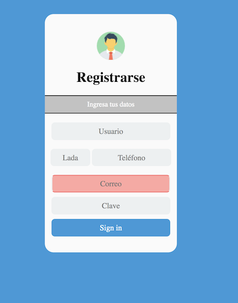

# Examen 1

## Instrucciones

Utilizando HTML y CSS codifique el formulario que se muestra en la siguiente imagen:

## Calificación

- (3 puntos) codificación del formulario en html
- (1 punto) estilo para el contenedor principal (caja blanca)
- (1 punto) estilo para la imagen de la parte superior
- (1 punto) estilo para el título principal
- (1 punto) estilo para el subtítulo "Ingresa tus datos"
- (1 punto) estilo para cajas de texto
- (1 punto) estilo para el botón
- (0.5 puntos) distribución de botones lada y teléfono
- (0.5 puntos) efecto para cambio de color para cuando el mouse pasa sobre las cajas de texto o el color (cambio de colores)
